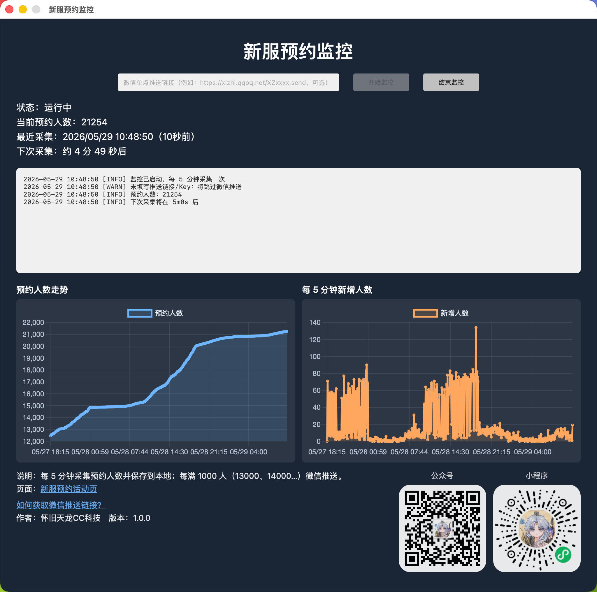

# tlhj-preheat-monitor（Wails）

怀旧天龙新服预约人数监控：每 5 分钟采集活动页预约人数，本地保存历史并在折线图展示；每满 1000 人可选微信推送。

仓库：<https://github.com/tlcc-tech/tlhj-preheat-monitor>

## 界面预览



## 环境要求

- Go 1.24+（建议使用 Homebrew 安装）
- Node.js 18+
- Wails CLI v2

macOS 建议确保 PATH 优先使用 Homebrew 的 Go：

```bash
echo 'export PATH="/opt/homebrew/bin:$PATH"' >> ~/.zshrc
source ~/.zshrc
go version
```

若 `go version` 仍是旧版本，请检查 `which go` 应为 `/opt/homebrew/bin/go`。

国内网络建议配置 Go 代理：

```bash
go env -w GOPROXY=https://goproxy.cn,direct GOSUMDB=off
```

## 开发运行

在项目根目录执行：

```bash
go mod tidy
cd frontend && npm install && cd ..
wails dev
```

## 构建产物

### macOS (.app)

```bash
wails build
```

产物默认在 `build/bin/` 下（`新服预约监控.app`）。

可选打包 `.dmg`：

```bash
./scripts/build-mac.sh
```

### Windows (.exe)

在 Windows 上执行：

```powershell
wails build
```

或：

```powershell
./scripts/build-win.ps1
```

## 网络慢：推荐用 GitHub Actions 打包

工作流：`.github/workflows/build.yml`

- 推送 tag（如 `v1.0.0`）到 GitHub，自动在 Windows / macOS 上构建并发布 Release
- 或在 GitHub Actions 页面手动触发（workflow_dispatch）

Release 产物：

- macOS：`新服预约监控.dmg`
- Windows：`新服预约监控-windows-amd64.exe`

## 配置与数据

- 设置与历史：`{UserConfigDir}/tlhj-preheat-monitor/`（`settings.json`、`history.json`）
- 微信推送：界面填写 [息知](https://xz.qqoq.net/) 单点推送 URL（可选）

## 预约人数 API

```bash
curl -sS \
  -H "User-Agent: Mozilla/5.0 (Macintosh; Intel Mac OS X 10_15_7) AppleWebKit/537.36" \
  -H "Referer: https://tlhj-activity.changyou.com/tlhj/preheat/20211215/pc/index.shtml" \
  -H "APP: tlgl" \
  -H "ACTIVITY: routineserver" \
  -H "VERSIONCODE: 20211202" \
  -H "PLAT: phone" \
  "https://tlhj-activity.changyou.com/tlgl/routineServer/voteInfo?phone=&code="
```

成功时 `code` 为 `10000`，人数在 `data.reserveCount`。

## 关于【怀旧天龙CC科技】

专注《怀旧天龙八部》玩家服务，玩转江湖更轻松；更新抢先看，第一时间解读游戏公告，分析版本变动；打造思路全分享，从入门到精通，门派养成、装备搭配、珍兽打造。关注我，让怀旧天龙更好玩！

- 公众号

  

- 小程序

  
